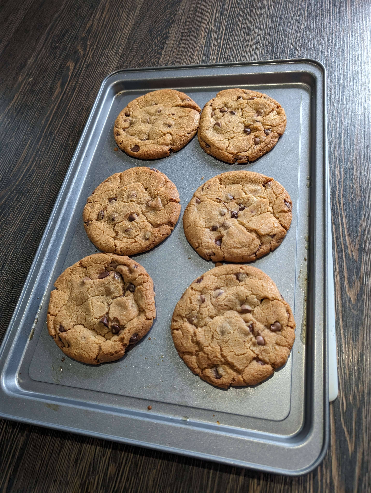

# The Cookies

THE official HutchyBen cookie recipe.

## Ingredients
- 150g Unsalted Butter (Browned)
- 200g Dark Brown Sugar
- 60g White Sugar
- 1 Egg
- 1tsp Vanilla Extract
- 1tsp Baking Soda (also known as bicarbonate of soda)
- 1tsp Salt
- 180g Plain Flour
- 125g Chocolate

### If wanting to make a chocolate dough 
> [!CAUTION]
> I have only baked chocolate cookies once or twice so measurements may not be too amazing.

- 50g Cocoa Powder
- 110g Plain Flour

### Notes
- Do not use baking powder, this will lead to a more cakey cookie.
- For chocolate, I recommend buying a bar of cooking chocolate and cutting into chunks. Chocolate chips will also work fine though.
- You can try other ratios of brown and white sugar, more brown leads to denser cookie more moist cookies and white makes it more fluffier and sweeter.

How to brown butter

1. Cut your butter into smaller pieces.
2. Get a pan and use medium-high heat.
3. Insert butter into pan until it melts.
4. Wait for butter to start bubbling/foaming.
5. Start stirring at regular intervals every 5s.
6. Wait till butter has a noticibly nutty scent and starts to brown.
7. Remove from heat.

## Directions

1. Add both the measured sugars to a mixing bowl
2. Brown your butter and allow for it to cool down.
3. Combine butter and sugar in the mixing bowl mixing till fully combined.
5. Crack egg and add to the mixing bowl with butter and sugar.
6. Add vanilla to the mixing bowl.
7. Whisk egg and vanilla until mixture can slowly drop off whisk and floats on mixture briefly.
8. Sieve flour into the mixing bowl.
9. Add salt, baking soda, and chocolate to the mixing bowl.
10. Combine all the dry ingredients by folding it in making sure not to overwork the mixture.
11. Put mixing bowl in the fridge, ideally leave it about 8 hours.
12. Preheat the oven to 165°C / 329°F
13. Get a **COLD** baking tray and roll dough into equal sized balls.
16. Insert baking tray with cookies into oven for 9 minutes.
17. Remove cookies from oven and leave to rest (I generally leave them 10 minutes).
18. Cookies

### Ideal firmness once removed from oven

https://github.com/HutchyBen/TheCookies/assets/38333275/dcc6cfb0-c46b-4cef-b557-0c4cb9ddb256
